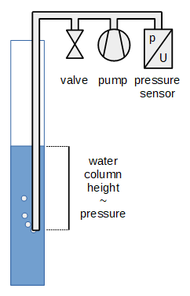
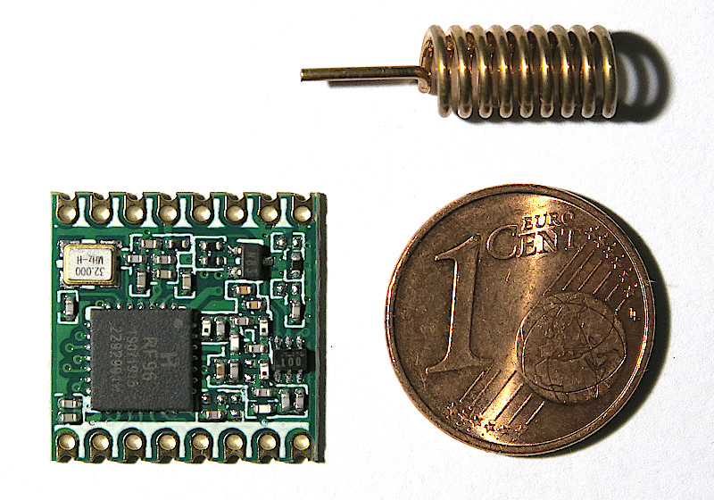

  
# Water Level Meter

Automated measurement of a fountain's water level with LoRa transmission, based on ESP32.

## Measurement Setup

A tube is fixed in the fountain with its end below the lowest expected water level. 
A pump blows air into the tube until it bubbles out of the lower end.
Then, the air pressure in the tube will be proportional to the forced-out water column height. 
The pump must be strong enough for the highest expected water level.

The idea for this principle is taken from this [discussion thread](https://www.mikrocontroller.net/topic/229838).

A one-way valve may be used in the tube to avoid intrusion of dirt and to shorten the required pumping duration to prolong battery life. Then, its placement must ensure that there is no permanent pressure at the sensor which could cause damage over time and also prevents measuring the zero pressure. The pressure loss caused by this valve must be compensated in the calcuation, too.

Pump, valve and pressure sensor can be taken from a cheap blood pressure monitor. An ADS1115 16 bit ADC is used to measure the small sensor voltage of some millivolts. An ESP32 µC controls the measurement procedure and transmits the result.

## Measurement Procedure

1. Ensure that the water level in the tube had time to relax while the pump was off and the valve open.
2. Read the zero level pressure.
3. Close valve, start pump and measure repeatedly until the pressure stops increasing. This means that the tube is now completely filled with air... or the pump was not strong enough:-)
4. The result level above the lower end of the tube is the difference between these two pressures, converted into water column height. Depending on the length and diameter of the tube, it may need some minor offset correction to compensate for the pressure loss of the flowing air.
5. Stop pump, open valve.

## LoRaWAN

LoRa module: HopeRF RFM95W, SX1276 compatible, and helix antenna for 868 MHz:

Front

Back (horizontally flipped over)

## TODO
* Schematic
* LoRa transmission, TTN
* Power management for maximum battery life
* Images of components, installation, ...
