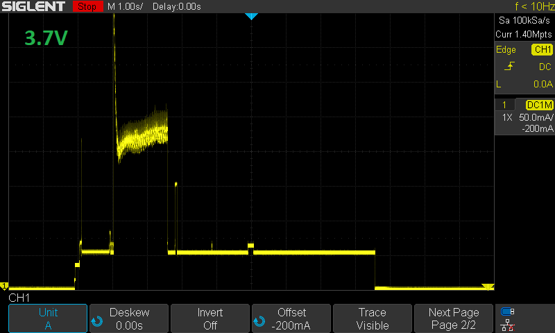

  
# Water Level Meter

Automated measurement of a well's water level with LoRa transmission, based on ESP32.

## Measurement Setup


A tube is fixed in the fountain with its end below the lowest expected water level. 
A pump blows air into the tube until it bubbles out of the lower end.
Then, the air pressure in the tube will be proportional to the forced-out water column height. 
The pump must be strong enough for the highest expected water level.

The idea for this principle is taken from this [discussion thread](https://www.mikrocontroller.net/topic/229838).

A one-way valve may be used in the tube to avoid intrusion of dirt and to shorten the required pumping duration to prolong battery life. Then, its placement must ensure that there is no permanent pressure at the sensor which could cause damage over time and also prevents measuring the zero pressure. The pressure loss caused by this valve must be compensated in the calcuation, too.

Pump, valve and pressure sensor can be taken from a cheap blood pressure monitor. An ADS1115 16 bit ADC is used to measure the small sensor voltage of some millivolts. An ESP32 µC controls the measurement procedure and transmits the result.

## Measurement Procedure

1. Ensure that the pressure at the sensor had enough time to relax (pump off, valve open).
2. Read the zero level pressure.
3. Close valve, start pump and measure repeatedly until the pressure stops increasing. This means that the tube is now completely filled with air... or the pump was not strong enough:-)
4. The result level above the lower end of the tube is the difference between these two pressures, converted into water column height. Depending on the length and diameter of the tube, it may need some minor offset correction to compensate for the pressure loss of the flowing air.
5. Stop pump, open valve.

## LoRaWAN / TTN

LoRa module: HopeRF RFM95W, SX1276 compatible, and helix antenna for 868 MHz

Front / Back horizontally flipped over:

 

Library: [ttn-esp32](https://github.com/manuelbl/ttn-esp32) is really easy to use and should have fewer timing problems on ESP32 than Arduino LMIC, since it is based on ESP-IDF/FreeRTOS tasks. Although it needs ESP-IDF, it can still be used together with the Arduino libs because these are also based on ESP-IDF. A `lib_compat_mode = off` in `platform.ini` enables its usage with framework `arduino`.

Saving and restoring the LoRa state over deep sleep in RTC memory is done by [TTNSession](include/TTNSession.h).

### Payload

Byte 0 and 1 contain the water level in millimeter as a 16 bit integer, high byte first.
Byte 2 and 3 contain the battery voltage in millivolt as a 16 bit integer, high byte first.
These 16 bit integers are encoded as two's complement if negative, which might appear for the water level.

TTN payload format decoder see [ttn_decoder.js](src/ttn_decoder.js).
It decodes `03 E0 0F 10` to
```
 {
   "batteryVolt": 3.856,
   "levelMeter": 0.992
 }
```

## Hardware

### First Working Prototype


### Power Consumption

Power consumption is critical for battery operation. The goal is having to access the battery only once a year while the well's level is measured every 5 minutes.

After lots of optimization, power consumption is finally dominated by the pump and the valve, although they are only active for few seconds in each cycle. This active phase has been cut down to the absolute minimum that can still deliver reliable measurements. It might further be improved with a one-way valve in the tube that keeps the air in, but still releases the pressure from the sensor.

To optimize the deep sleep current, an EzSBC ESP32-01 board has been used, which leads to really great 12 µA. This board behaved by far best of all tested ones, see [esp32-power-consumption-test](https://github.com/grillbaer/esp32-power-consumption-test). To achieve this low current, the peripheral circuits for measurement and LoRa are supplied by a separate 3.3 V voltage regulator that can be switched on and off by software. Using regular GPIO pins for SPI and the other outputs failed, since they cannot be isolated or pulled low during deep sleep. This lead to considerable leakage currents. However, this is possible for the RTC-powered GPIO pins. The software prepares them for deep sleep by isolating or pulling low (hold). Which pin behaves in which way is not easily obvious. 

This is one measurement cycle with LoRa transmission (without join):




* Pump and value active ~ 0.6 s &ndash; 3.5 s depending on water level and pump voltage, higher pump voltage leads
  to much shorter active phase
* LoRa transmission active ~ 0.1 s
* Full awake phase ~ 9 s

Battery life estimation see [battery-consumption.ods](doc/battery-consumption.ods).

Optimized prototype:


## Battery Monitoring

To monitor the remaining battery voltage, it is fed into another free channel of the ADC using a voltage divider. It is powered from the switchable peripherals voltage before the regulator to avoid unnecessary battery drain. The transistor switch causes a voltage loss of 30 to 40 mV which could be (but is not) compensated in the software as well as the resistor deviations.

## TODO

* Schematic
* PCB
* Details on used blood pressure monitor components
* Which battery to use for 1a without replacement?
* Images of components, installation, ...
* Go to sleep also after failed join, try join next time. Joins are not really reliable... or completely go to ABP and try to store frame counter in NVM
* Document and link used libraries and components
